# AI-Powered Trading & Chat Platform - Architecture

## Executive Summary

This document provides comprehensive architecture diagrams for the AI-Powered Trading & Chat Platform, covering system architecture, microservices, load balancing, CDN, data architecture, security, monitoring, and deployment strategies.

---

## 1. High-Level System Architecture

---

## 2. Microservices Architecture & Service Interactions

```mermaid
graph TB
    subgraph "Frontend Services"
        WEB_APP[Web Application<br/>React/Vue]
        MOBILE_APP[Mobile App<br/>React Native/Flutter]
    end

    subgraph "API Gateway & Routing"
        API_GW[API Gateway<br/>Kong/AWS API Gateway]
        ROUTER[Service Router<br/>Consul/etcd]
    end

    subgraph "Core Microservices"
        AUTH[Auth Service<br/>Port: 3001<br/>gRPC + REST]
        USER[User Service<br/>Port: 3002<br/>gRPC + REST]
        CHAT[Chat Service<br/>Port: 3003<br/>WebSocket + gRPC]
        DISCUSSION[Discussion Hub<br/>Port: 3004<br/>REST + gRPC]
        CHART[Chart Service<br/>Port: 3005<br/>gRPC]
        ALERT[Alert Service<br/>Port: 3006<br/>gRPC + REST]
        AI[AI/ML Service<br/>Port: 3007<br/>gRPC + REST]
        MEMORY[Memory Service<br/>Port: 3008<br/>gRPC]
        WORKER[Worker Service<br/>Port: 3009<br/>Background Jobs]
        AUDIT[Audit Service<br/>Port: 3010<br/>gRPC]
    end

    subgraph "Service Communication"
        GRPC[gRPC Layer<br/>Protocol Buffers]
        REST[REST API Layer<br/>JSON]
        WS[WebSocket Layer<br/>Real-time]
        KAFKA_MSG[Kafka Messaging<br/>Event-Driven]
    end

    subgraph "Data Services"
        PG[(PostgreSQL)]
        MONGO[(MongoDB)]
        REDIS_CACHE[(Redis)]
        TSDB[(TimescaleDB)]
        VDB[(Vector DB)]
        ES[(Elasticsearch)]
        OBJ_STORE[(Object Store)]
    end

    WEB_APP --> API_GW
    MOBILE_APP --> API_GW
    API_GW --> ROUTER
    
    ROUTER --> AUTH
    ROUTER --> USER
    ROUTER --> CHAT
    ROUTER --> DISCUSSION
    ROUTER --> CHART
    ROUTER --> ALERT
    ROUTER --> AI
    ROUTER --> MEMORY
    
    AUTH --> GRPC
    USER --> GRPC
    CHAT --> WS
    CHAT --> GRPC
    DISCUSSION --> REST
    DISCUSSION --> GRPC
    CHART --> GRPC
    ALERT --> GRPC
    AI --> GRPC
    MEMORY --> GRPC
    WORKER --> KAFKA_MSG
    AUDIT --> GRPC
    
    AUTH --> PG
    AUTH --> REDIS_CACHE
    USER --> PG
    CHAT --> PG
    CHAT --> MONGO
    CHAT --> REDIS_CACHE
    DISCUSSION --> MONGO
    DISCUSSION --> ES
    CHART --> TSDB
    CHART --> OBJ_STORE
    ALERT --> PG
    ALERT --> REDIS_CACHE
    AI --> VDB
    AI --> PG
    MEMORY --> VDB
    MEMORY --> PG
    WORKER --> PG
    WORKER --> VDB
    AUDIT --> ES
    AUDIT --> PG
    
    CHAT --> KAFKA_MSG
    AI --> KAFKA_MSG
    ALERT --> KAFKA_MSG
    WORKER --> KAFKA_MSG
    
    style API_GW fill:#F5A623,stroke:#B87A0F,stroke-width:2px,color:#fff
    style AUTH fill:#E94B3C,stroke:#A83228,stroke-width:2px,color:#fff
    style CHAT fill:#E94B3C,stroke:#A83228,stroke-width:2px,color:#fff
    style AI fill:#E94B3C,stroke:#A83228,stroke-width:2px,color:#fff
    style GRPC fill:#50C878,stroke:#2D7A4A,stroke-width:2px,color:#fff
    style KAFKA_MSG fill:#50C878,stroke:#2D7A4A,stroke-width:2px,color:#fff
```

---

## 3. Load Balancing & CDN Architecture

---

## 4. Scalable Data Architecture

---

## 5. Security Architecture

---

## 6. Monitoring & Observability Architecture

---

## 7. Deployment & Infrastructure Architecture (Kubernetes)

---

## 8. AI/ML Service Architecture

---

## 9. Real-time Chat Architecture (WebSocket & Event Streaming)

---

## 10. Data Flow Architecture

---

## Architecture Summary

### Key Architectural Principles

1. **Microservices Architecture**: Loosely coupled services for independent scaling and deployment
2. **Event-Driven Design**: Kafka-based messaging for asynchronous communication
3. **Multi-Region Deployment**: Global CDN and load balancing for low latency
4. **Scalable Data Architecture**: Read replicas, caching, and tiered storage
5. **Security-First**: End-to-end encryption, RBAC, and comprehensive audit logging
6. **Observability**: Full-stack monitoring with Prometheus, Grafana, and distributed tracing
7. **Container Orchestration**: Kubernetes for automated scaling and management
8. **AI/ML Integration**: RAG system with vector databases for intelligent responses

### Technology Stack Summary

- **Backend**: Node.js (Fastify), gRPC, WebSocket
- **Databases**: PostgreSQL, MongoDB, Redis, TimescaleDB, Vector DB (Qdrant/Weaviate), Elasticsearch
- **Message Queue**: Apache Kafka, Redis Pub/Sub
- **Infrastructure**: Docker, Kubernetes, Helm
- **Monitoring**: Prometheus, Grafana, Jaeger, ELK Stack
- **Security**: TLS 1.3, RBAC, Secrets Management, WAF
- **CDN**: CloudFlare/AWS CloudFront
- **AI/ML**: LLM Inference, RAG, PyTorch/TensorFlow

### Scalability Features

- Horizontal Pod Autoscaling (HPA) in Kubernetes
- Database read replicas for query scaling
- Redis caching layer for hot data
- CDN for static content delivery
- Load balancing across multiple regions
- Event-driven architecture for decoupled services

### High Availability

- Multi-AZ (Availability Zone) deployment
- Database replication and failover
- Automated backups and disaster recovery
- Health checks and auto-recovery
- Circuit breakers for fault tolerance

---

