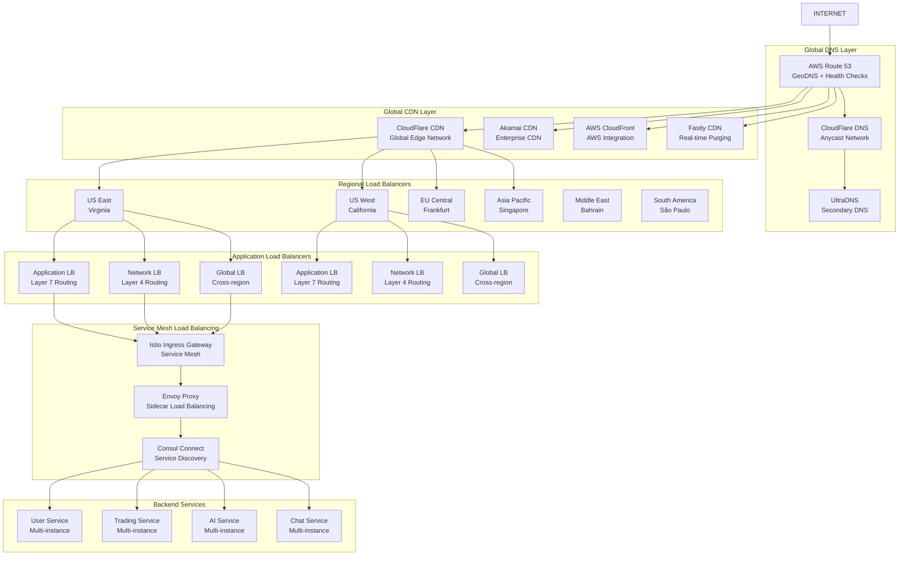

# Load Balancing & CDN Strategy

## 🌐 Global Load Balancing Architecture



## 🎯 Multi-Layer Load Balancing Strategy

### Layer 1: Global DNS Load Balancing

```yaml
# route53-config.yaml
apiVersion: v1
kind: ConfigMap
metadata:
  name: route53-health-checks
data:
  health-checks.json: |
    {
      "healthChecks": [
        {
          "id": "us-east-health",
          "type": "HTTPS",
          "resourcePath": "/health",
          "fqdn": "api-us-east.tradingplatform.com",
          "port": 443,
          "requestInterval": 30,
          "failureThreshold": 3,
          "enableSNI": true,
          "regions": ["us-east-1"]
        },
        {
          "id": "us-west-health",
          "type": "HTTPS",
          "resourcePath": "/health",
          "fqdn": "api-us-west.tradingplatform.com",
          "port": 443,
          "requestInterval": 30,
          "failureThreshold": 3,
          "enableSNI": true,
          "regions": ["us-west-2"]
        },
        {
          "id": "eu-central-health",
          "type": "HTTPS",
          "resourcePath": "/health",
          "fqdn": "api-eu-central.tradingplatform.com",
          "port": 443,
          "requestInterval": 30,
          "failureThreshold": 3,
          "enableSNI": true,
          "regions": ["eu-central-1"]
        }
      ]
    }
  
  routing-policies.json: |
    {
      "routingPolicies": [
        {
          "name": "geographic-routing",
          "type": "GEOLOCATION",
          "rules": [
            {
              "continent": "North America",
              "records": [
                {"weight": 70, "value": "api-us-east.tradingplatform.com"},
                {"weight": 30, "value": "api-us-west.tradingplatform.com"}
              ]
            },
            {
              "continent": "Europe",
              "records": [
                {"weight": 100, "value": "api-eu-central.tradingplatform.com"}
              ]
            },
            {
              "continent": "Asia",
              "records": [
                {"weight": 60, "value": "api-asia-pacific.tradingplatform.com"},
                {"weight": 40, "value": "api-us-west.tradingplatform.com"}
              ]
            }
          ]
        },
        {
          "name": "latency-based-routing",
          "type": "LATENCY",
          "healthCheckIds": ["us-east-health", "us-west-health", "eu-central-health"],
          "regions": ["us-east-1", "us-west-2", "eu-central-1"]
        },
        {
          "name": "failover-routing",
          "type": "FAILOVER",
          "primary": "api-us-east.tradingplatform.com",
          "secondary": [
            "api-us-west.tradingplatform.com",
            "api-eu-central.tradingplatform.com"
          ]
        }
      ]
    }
```

### Layer 2: CDN Configuration

```yaml
# cloudflare-cdn-config.yaml
apiVersion: v1
kind: ConfigMap
metadata:
  name: cloudflare-cdn-policies
data:
  page-rules.json: |
    {
      "pageRules": [
        {
          "targets": [
            {
              "target": "url",
              "constraint": {
                "operator": "matches",
                "value": "*tradingplatform.com/api/v1/market-data*"
              }
            }
          ],
          "actions": [
            {
              "id": "cache_level",
              "value": "cache_everything"
            },
            {
              "id": "edge_cache_ttl",
              "value": 30
            },
            {
              "id": "browser_cache_ttl",
              "value": 30
            }
          ],
          "priority": 1,
          "status": "active"
        },
        {
          "targets": [
            {
              "target": "url",
              "constraint": {
                "operator": "matches",
                "value": "*tradingplatform.com/static/*"
              }
            }
          ],
          "actions": [
            {
              "id": "cache_level",
              "value": "cache_everything"
            },
            {
              "id": "edge_cache_ttl",
              "value": 2592000
            },
            {
              "id": "browser_cache_ttl",
              "value": 2592000
            }
          ],
          "priority": 2,
          "status": "active"
        },
        {
          "targets": [
            {
              "target": "url",
              "constraint": {
                "operator": "matches",
                "value": "*tradingplatform.com/api/v1/user/*"
              }
            }
          ],
          "actions": [
            {
              "id": "cache_level",
              "value": "bypass"
            }
          ],
          "priority": 3,
          "status": "active"
        }
      ]
    }
  
  caching-rules.json: |
    {
      "cachingRules": {
        "default": {
          "cacheLevel": "aggressive",
          "browserCacheTtl": 14400,
          "edgeCacheTtl": 7200,
          "cacheByDeviceType": true,
          "cacheByQueryString": "ignore_query_string"
        },
        "apiEndpoints": {
          "/api/v1/market-data": {
            "cacheLevel": "cache_everything",
            "browserCacheTtl": 60,
            "edgeCacheTtl": 60,
            "respectStrongEtag": true
          },
          "/api/v1/trading/prices": {
            "cacheLevel": "cache_everything",
            "browserCacheTtl": 30,
            "edgeCacheTtl": 30,
            "cacheKey": "${uri}_${header:accept-encoding}"
          },
          "/api/v1/chat/history": {
            "cacheLevel": "bypass",
            "browserCacheTtl": 0,
            "edgeCacheTtl": 0
          }
        }
      }
    }
```

### Layer 3: Application Load Balancer

```yaml
# aws-alb-config.yaml
apiVersion: v1
kind: ConfigMap
metadata:
  name: alb-ingress-config
data:
  alb-ingress-controller.yaml: |
    apiVersion: networking.k8s.io/v1
    kind: Ingress
    metadata:
      name: trading-platform-alb
      namespace: trading-platform
      annotations:
        kubernetes.io/ingress.class: alb
        alb.ingress.kubernetes.io/scheme: internet-facing
        alb.ingress.kubernetes.io/target-type: ip
        alb.ingress.kubernetes.io/ip-address-type: dualstack
        alb.ingress.kubernetes.io/load-balancer-name: trading-platform-alb
        alb.ingress.kubernetes.io/ssl-redirect: '443'
        alb.ingress.kubernetes.io/certificate-arn: arn:aws:acm:us-east-1:123456789012:certificate/12345678-1234-1234-1234-123456789012
        alb.ingress.kubernetes.io/ssl-policy: ELBSecurityPolicy-TLS-1-2-2017-01
        alb.ingress.kubernetes.io/load-balancer-attributes: |
          access_logs.s3.enabled=true,
          access_logs.s3.bucket=trading-platform-alb-logs,
          access_logs.s3.prefix=alb-logs,
          idle_timeout.timeout_seconds=60,
          routing.http2.enabled=true,
          routing.http.drop_invalid_header_fields.enabled=true,
          deletion_protection.enabled=true
        alb.ingress.kubernetes.io/target-group-attributes: |
          stickiness.enabled=true,
          stickiness.type=lb_cookie,
          stickiness.lb_cookie.duration_seconds=86400,
          deregistration_delay.timeout_seconds=30,
          slow_start.duration_seconds=30
        alb.ingress.kubernetes.io/health-check-path: /health
        alb.ingress.kubernetes.io/health-check-interval-seconds: '30'
        alb.ingress.kubernetes.io/health-check-timeout-seconds: '5'
        alb.ingress.kubernetes.io/healthy-threshold-count: '2'
        alb.ingress.kubernetes.io/unhealthy-threshold-count: '3'
        alb.ingress.kubernetes.io/success-codes: '200,201,204'
        alb.ingress.kubernetes.io/conditions.api-gateway: |
          [{"Field":"path-pattern","PathPatternConfig":{"Values":["/api/v1/*"]}}]
    spec:
      rules:
      - host: api.tradingplatform.com
        http:
          paths:
          - path: /api/v1/auth
            pathType: Prefix
            backend:
              service:
                name: auth-service
                port:
                  number: 8080
          - path: /api/v1/users
            pathType: Prefix
            backend:
              service:
                name: user-service
                port:
                  number: 8080
          - path: /api/v1/trading
            pathType: Prefix
            backend:
              service:
                name: trading-service
                port:
                  number: 8080
          - path: /api/v1/chat
            pathType: Prefix
            backend:
              service:
                name: chat-service
                port:
                  number: 8080
          - path: /api/v1/ai
            pathType: Prefix
            backend:
              service:
                name: ai-service
                port:
                  number: 8080
          - path: /ws
            pathType: Prefix
            backend:
              service:
                name: websocket-service
                port:
                  number: 8080
```

### Layer 4: Service Mesh Load Balancing

```yaml
# istio-service-mesh-config.yaml
apiVersion: networking.istio.io/v1beta1
kind: VirtualService
metadata:
  name: trading-platform-vs
  namespace: trading-platform
spec:
  hosts:
  - api.tradingplatform.com
  gateways:
  - trading-platform-gateway
  http:
  - match:
    - uri:
        prefix: /api/v1/auth
    route:
    - destination:
        host: auth-service
        port:
          number: 8080
      weight: 100
    timeout: 30s
    retries:
      attempts: 3
      perTryTimeout: 10s
      retryOn: 5xx,reset,connect-failure,refused-stream
    fault:
      delay:
        percentage:
          value: 0.1
        fixedDelay: 5s
      abort:
        percentage:
          value: 0.1
        httpStatus: 503
  - match:
    - uri:
        prefix: /api/v1/trading
    route:
    - destination:
        host: trading-service
        port:
          number: 8080
      weight: 80
    - destination:
        host: trading-service-canary
        port:
          number: 8080
      weight: 20
    timeout: 60s
    retries:
      attempts: 2
      perTryTimeout: 30s
    fault:
      delay:
        percentage:
          value: 0.05
        fixedDelay: 2s
  - match:
    - uri:
        prefix: /ws
    route:
    - destination:
        host: websocket-service
        port:
          number: 8080
      weight: 100
    timeout: 0s  # No timeout for WebSocket
    retries:
      attempts: 0  # No retries for WebSocket
---
apiVersion: networking.istio.io/v1beta1
kind: DestinationRule
metadata:
  name: trading-platform-dr
  namespace: trading-platform
spec:
  host: '*.trading-platform.svc.cluster.local'
  trafficPolicy:
    connectionPool:
      tcp:
        maxConnections: 1000
        connectTimeout: 30s
        tcpKeepalive:
          time: 60s
          interval: 30s
          probes: 3
      http:
        http1MaxPendingRequests: 200
        http2MaxRequests: 1000
        maxRequestsPerConnection: 10
        maxRetries: 3
        consecutiveGatewayErrors: 5
        useClientProtocol: true
        h2UpgradePolicy: UPGRADE
    loadBalancer:
      simple: LEAST_CONN
      consistentHash:
        httpCookie:
          name: "session-cookie"
          ttl: 3600s
        minimumRingSize: 1024
    outlierDetection:
      consecutiveErrors: 5
      interval: 30s
      baseEjectionTime: 30s
      maxEjectionPercent: 50
      minHealthPercent: 30
      splitExternalLocalOriginErrors: true
      consecutiveLocalOriginFailures: 3
---
apiVersion: networking.istio.io/v1beta1
kind: Gateway
metadata:
  name: trading-platform-gateway
  namespace: trading-platform
spec:
  selector:
    istio: ingressgateway
  servers:
  - port:
      number: 80
      name: http
      protocol: HTTP
    hosts:
    - api.tradingplatform.com
    tls:
      httpsRedirect: true
  - port:
      number: 443
      name: https
      protocol: HTTPS
    tls:
      mode: SIMPLE
      credentialName: trading-platform-tls-secret
    hosts:
    - api.tradingplatform.com
```

## 🚀 Performance Optimization Strategies

### 1. Connection Pooling

```yaml
# connection-pool-config.yaml
apiVersion: v1
kind: ConfigMap
metadata:
  name: connection-pool-config
data:
  envoy-config.yaml: |
    static_resources:
      clusters:
      - name: trading-service
        connect_timeout: 30s
        type: STRICT_DNS
        lb_policy: LEAST_REQUEST
        load_assignment:
          cluster_name: trading-service
          endpoints:
          - lb_endpoints:
            - endpoint:
                address:
                  socket_address:
                    address: trading-service
                    port_value: 8080
        circuit_breakers:
          thresholds:
            max_connections: 1000
            max_pending_requests: 200
            max_requests: 1000
            max_retries: 3
            track_remaining: true
            retry_budget:
              budget_percent:
                value: 25
              min_retry_concurrency: 5
        upstream_connection_options:
          tcp_keepalive:
            keepalive_time: 300
            keepalive_interval: 30
            keepalive_probes: 3
        common_http_protocol_options:
          idle_timeout: 3600s
          max_connection_duration: 86400s
      
      - name: user-service
        connect_timeout: 15s
        type: STRICT_DNS
        lb_policy: ROUND_ROBIN
        load_assignment:
          cluster_name: user-service
          endpoints:
          - lb_endpoints:
            - endpoint:
                    address:
                      socket_address:
                        address: user-service
                        port_value: 8080
        circuit_breakers:
          thresholds:
            max_connections: 500
            max_pending_requests: 100
            max_requests: 500
            max_retries: 2
```

### 2. Auto-scaling Configuration

```yaml
# hpa-config.yaml
apiVersion: autoscaling/v2
kind: HorizontalPodAutoscaler
metadata:
  name: trading-service-hpa
  namespace: trading-platform
spec:
  scaleTargetRef:
    apiVersion: apps/v1
    kind: Deployment
    name: trading-service
  minReplicas: 3
  maxReplicas: 50
  metrics:
  - type: Resource
    resource:
      name: cpu
      target:
        type: Utilization
        averageUtilization: 70
  - type: Resource
    resource:
      name: memory
      target:
        type: Utilization
        averageUtilization: 80
  - type: Pods
    pods:
      metric:
        name: http_requests_per_second
      target:
        type: AverageValue
        averageValue: "1000"
  - type: External
    external:
      metric:
        name: pubsub.googleapis.com|subscription|num_undelivered_messages
        selector:
          matchLabels:
            resource.labels.subscription_id: trading-events-subscription
      target:
        type: AverageValue
        averageValue: "100"
  behavior:
    scaleUp:
      stabilizationWindowSeconds: 60
      policies:
      - type: Percent
        value: 100
        periodSeconds: 15
      - type: Pods
        value: 5
        periodSeconds: 15
      selectPolicy: Max
    scaleDown:
      stabilizationWindowSeconds: 300
      policies:
      - type: Percent
        value: 50
        periodSeconds: 60
      - type: Pods
        value: 2
        periodSeconds: 60
      selectPolicy: Min
---
apiVersion: autoscaling/v2
kind: VerticalPodAutoscaler
metadata:
  name: trading-service-vpa
  namespace: trading-platform
spec:
  targetRef:
    apiVersion: apps/v1
    kind: Deployment
    name: trading-service
  updatePolicy:
    updateMode: "Auto"
  resourcePolicy:
    containerPolicies:
    - containerName: trading-service
      minAllowed:
        cpu: 100m
        memory: 128Mi
      maxAllowed:
        cpu: 2
        memory: 4Gi
      controlledResources: ["cpu", "memory"]
```

### 3. Geographic Load Distribution

```yaml
# geo-routing-config.yaml
apiVersion: v1
kind: ConfigMap
metadata:
  name: geo-routing-policies
data:
  routing-logic.js: |
    // Geographic routing logic for optimal performance
    function routeRequest(userLocation, serverHealth) {
      const regions = {
        'US-East': {
          servers: ['us-east-1', 'us-east-2'],
          latency: 20,
          capacity: 0.8,
          health: serverHealth['us-east']
        },
        'US-West': {
          servers: ['us-west-1', 'us-west-2'],
          latency: 50,
          capacity: 0.7,
          health: serverHealth['us-west']
        },
        'EU-Central': {
          servers: ['eu-central-1', 'eu-west-1'],
          latency: 100,
          capacity: 0.6,
          health: serverHealth['eu-central']
        },
        'Asia-Pacific': {
          servers: ['ap-southeast-1', 'ap-northeast-1'],
          latency: 150,
          capacity: 0.5,
          health: serverHealth['asia-pacific']
        }
      };
      
      // Calculate routing score based on multiple factors
      function calculateScore(region, userLocation) {
        const distance = calculateDistance(userLocation, region);
        const latency = region.latency;
        const capacity = region.capacity;
        const health = region.health;
        const load = getCurrentLoad(region.servers);
        
        // Weighted scoring algorithm
        const score = (
          health * 0.4 +           // 40% - Health status
          (1 - latency / 200) * 0.3 + // 30% - Latency (normalized)
          capacity * 0.2 +         // 20% - Available capacity
          (1 - load) * 0.1         // 10% - Current load
        );
        
        return score;
      }
      
      // Select best region based on score
      let bestRegion = null;
      let bestScore = -1;
      
      for (const regionName in regions) {
        const region = regions[regionName];
        if (region.health > 0.5) {  // Only consider healthy regions
          const score = calculateScore(region, userLocation);
          if (score > bestScore) {
            bestScore = score;
            bestRegion = regionName;
          }
        }
      }
      
      return bestRegion || 'US-East'; // Default fallback
    }
    
    // Real-time load balancing algorithm
    function loadBalance(request, availableServers) {
      const userLocation = getUserLocation(request);
      const serverHealth = getServerHealth();
      const selectedRegion = routeRequest(userLocation, serverHealth);
      
      // Within region, use least connections algorithm
      const regionServers = availableServers[selectedRegion];
      return regionServers.reduce((best, current) => 
        current.connections < best.connections ? current : best
      );
    }
```

## 📊 Performance Monitoring & Analytics

### Load Balancer Metrics

```yaml
# monitoring-config.yaml
apiVersion: v1
kind: ConfigMap
metadata:
  name: load-balancer-metrics
data:
  prometheus-rules.yaml: |
    groups:
    - name: load_balancer_alerts
      interval: 30s
      rules:
      - alert: HighRequestLatency
        expr: |
          histogram_quantile(0.95, 
            rate(http_request_duration_seconds_bucket[5m])
          ) > 0.5
        for: 5m
        labels:
          severity: warning
          team: platform
        annotations:
          summary: "High request latency detected"
          description: "95th percentile latency is {{ $value }}s for {{ $labels.service }}"
      
      - alert: HighErrorRate
        expr: |
          rate(http_requests_total{status=~"5.."}[5m]) /
          rate(http_requests_total[5m]) > 0.05
        for: 5m
        labels:
          severity: critical
          team: platform
        annotations:
          summary: "High error rate detected"
          description: "Error rate is {{ $value | humanizePercentage }} for {{ $labels.service }}"
      
      - alert: LoadBalancerUnhealthy
        expr: |
          up{job="load-balancer"} == 0
        for: 1m
        labels:
          severity: critical
          team: platform
        annotations:
          summary: "Load balancer is unhealthy"
          description: "{{ $labels.instance }} is down"
      
      - alert: HighConnectionCount
        expr: |
          sum(active_connections) by (instance) > 10000
        for: 5m
        labels:
          severity: warning
          team: platform
        annotations:
          summary: "High connection count"
          description: "{{ $labels.instance }} has {{ $value }} active connections"
      
      - alert: CertificateExpiry
        expr: |
          ssl_certificate_expiry_seconds < 7 * 24 * 3600
        for: 1h
        labels:
          severity: warning
          team: security
        annotations:
          summary: "SSL certificate expiring soon"
          description: "Certificate for {{ $labels.domain }} expires in {{ $value | humanizeDuration }}"
  
  grafana-dashboards.json: |
    {
      "dashboards": [
        {
          "name": "Load Balancer Overview",
          "panels": [
            {
              "title": "Request Rate by Region",
              "type": "graph",
              "targets": [
                {
                  "expr": "rate(http_requests_total[5m])",
                  "legendFormat": "{{region}} - {{service}}"
                }
              ]
            },
            {
              "title": "Response Time Percentiles",
              "type": "graph",
              "targets": [
                {
                  "expr": "histogram_quantile(0.50, rate(http_request_duration_seconds_bucket[5m]))",
                  "legendFormat": "50th percentile"
                },
                {
                  "expr": "histogram_quantile(0.95, rate(http_request_duration_seconds_bucket[5m]))",
                  "legendFormat": "95th percentile"
                },
                {
                  "expr": "histogram_quantile(0.99, rate(http_request_duration_seconds_bucket[5m]))",
                  "legendFormat": "99th percentile"
                }
              ]
            },
            {
              "title": "Error Rate by Service",
              "type": "graph",
              "targets": [
                {
                  "expr": "rate(http_requests_total{status=~\"5..\"}[5m]) / rate(http_requests_total[5m])",
                  "legendFormat": "{{service}} error rate"
                }
              ]
            },
            {
              "title": "Active Connections",
              "type": "singlestat",
              "targets": [
                {
                  "expr": "sum(active_connections)",
                  "legendFormat": "Total Connections"
                }
              ]
            }
          ]
        }
      ]
    }
```

## 🎯 Key Load Balancing Benefits

### 1. **High Availability (99.99% Uptime)**
- Multi-region deployment with automatic failover
- Health checks and circuit breakers
- Geographic redundancy
- Real-time traffic routing

### 2. **Performance Optimization**
- Global edge caching with CDN
- Intelligent traffic routing
- Connection pooling and keep-alive
- Compression and optimization

### 3. **Scalability**
- Auto-scaling based on demand
- Horizontal and vertical scaling
- Load distribution algorithms
- Capacity planning and monitoring

### 4. **Security**
- DDoS protection and mitigation
- SSL/TLS termination and encryption
- WAF integration
- Rate limiting and throttling

### 5. **Cost Optimization**
- Efficient resource utilization
- Bandwidth optimization
- Reduced origin server load
- Intelligent caching strategies

This comprehensive load balancing and CDN strategy ensures your AI-powered trading platform can handle massive traffic loads while maintaining excellent performance, security, and reliability across global markets.