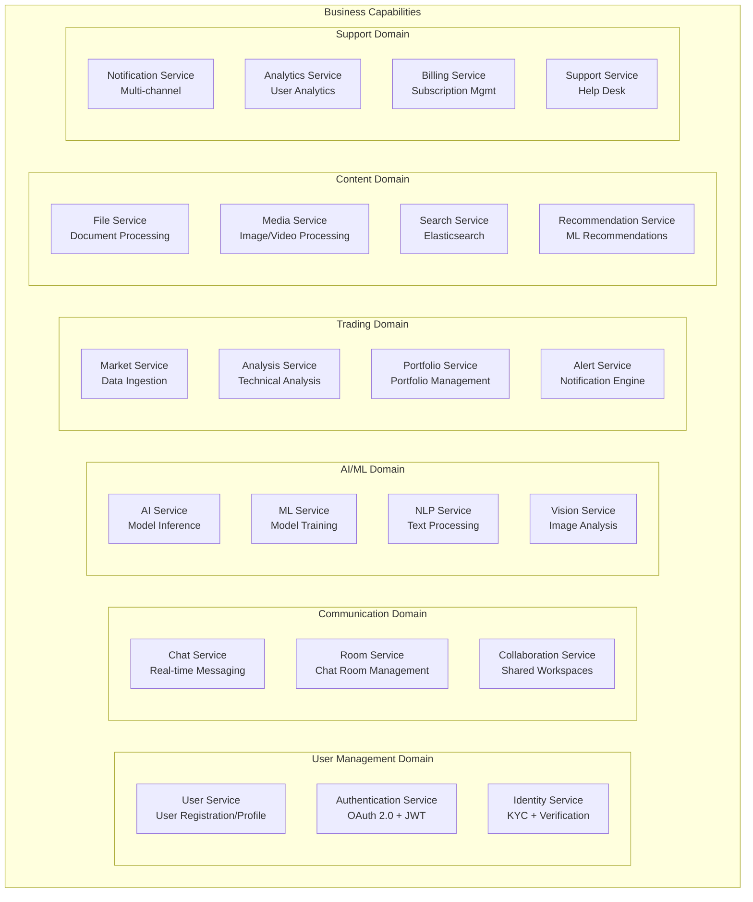
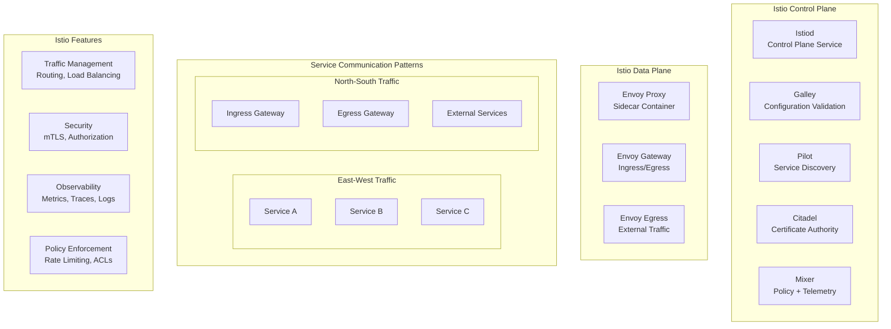

# Microservices Architecture & Service Mesh Implementation

## 🏗️ Microservices Architecture Design

### Service Decomposition Strategy



## 🔗 Service Mesh Architecture (Istio)

### Istio Control Plane



## 📋 Service Specifications

### 1. User Service
```yaml
# user-service-deployment.yaml
apiVersion: apps/v1
kind: Deployment
metadata:
  name: user-service
  namespace: trading-platform
spec:
  replicas: 3
  selector:
    matchLabels:
      app: user-service
  template:
    metadata:
      labels:
        app: user-service
        version: v1.2.0
      annotations:
        sidecar.istio.io/inject: "true"
        prometheus.io/scrape: "true"
        prometheus.io/port: "8080"
    spec:
      containers:
      - name: user-service
        image: trading-platform/user-service:v1.2.0
        ports:
        - containerPort: 8080
          name: http
        - containerPort: 8081
          name: health
        env:
        - name: DATABASE_URL
          valueFrom:
            secretKeyRef:
              name: user-db-secret
              key: connection-string
        - name: JWT_SECRET
          valueFrom:
            secretKeyRef:
              name: jwt-secret
              key: secret
        resources:
          requests:
            memory: "512Mi"
            cpu: "250m"
          limits:
            memory: "1Gi"
            cpu: "500m"
        livenessProbe:
          httpGet:
            path: /health/live
            port: 8081
          initialDelaySeconds: 30
          periodSeconds: 10
        readinessProbe:
          httpGet:
            path: /health/ready
            port: 8081
          initialDelaySeconds: 5
          periodSeconds: 5
```

### 2. Service Mesh Configuration
```yaml
# virtual-service.yaml
apiVersion: networking.istio.io/v1beta1
kind: VirtualService
metadata:
  name: user-service
  namespace: trading-platform
spec:
  hosts:
  - user-service
  http:
  - match:
    - headers:
        version:
          exact: v2
    route:
    - destination:
        host: user-service
        subset: v2
      weight: 100
  - route:
    - destination:
        host: user-service
        subset: v1
      weight: 90
    - destination:
        host: user-service
        subset: v2
      weight: 10
    timeout: 30s
    retries:
      attempts: 3
      perTryTimeout: 10s
      retryOn: 5xx,reset,connect-failure,refused-stream
---
apiVersion: networking.istio.io/v1beta1
kind: DestinationRule
metadata:
  name: user-service
  namespace: trading-platform
spec:
  host: user-service
  trafficPolicy:
    connectionPool:
      tcp:
        maxConnections: 100
      http:
        http1MaxPendingRequests: 50
        http2MaxRequests: 100
    loadBalancer:
      simple: LEAST_CONN
    outlierDetection:
      consecutiveErrors: 5
      interval: 30s
      baseEjectionTime: 30s
      maxEjectionPercent: 50
      minHealthPercent: 30
  subsets:
  - name: v1
    labels:
      version: v1.2.0
  - name: v2
    labels:
      version: v2.0.0
```

### 3. Security Configuration
```yaml
# peer-authentication.yaml
apiVersion: security.istio.io/v1beta1
kind: PeerAuthentication
metadata:
  name: default
  namespace: trading-platform
spec:
  mtls:
    mode: STRICT
---
apiVersion: security.istio.io/v1beta1
kind: AuthorizationPolicy
metadata:
  name: user-service-authz
  namespace: trading-platform
spec:
  selector:
    matchLabels:
      app: user-service
  rules:
  - from:
    - source:
        principals: ["cluster.local/ns/trading-platform/sa/api-gateway"]
    - source:
        principals: ["cluster.local/ns/trading-platform/sa/chat-service"]
  - when:
    - key: request.headers[x-user-role]
      values: ["admin", "user"]
  - to:
    - operation:
        methods: ["GET", "POST", "PUT"]
        paths: ["/api/v1/users/*"]
```

## 🚀 Service Communication Patterns

### Synchronous Communication (gRPC)
```protobuf
// user-service.proto
syntax = "proto3";

package trading.platform.user;

service UserService {
  rpc GetUser(GetUserRequest) returns (GetUserResponse);
  rpc CreateUser(CreateUserRequest) returns (CreateUserResponse);
  rpc UpdateUser(UpdateUserRequest) returns (UpdateUserResponse);
  rpc DeleteUser(DeleteUserRequest) returns (DeleteUserResponse);
  rpc ListUsers(ListUsersRequest) returns (ListUsersResponse);
  rpc AuthenticateUser(AuthRequest) returns (AuthResponse);
}

message GetUserRequest {
  string user_id = 1;
  repeated string fields = 2;
}

message GetUserResponse {
  User user = 1;
  ResponseMetadata metadata = 2;
}

message User {
  string user_id = 1;
  string email = 2;
  string username = 3;
  string first_name = 4;
  string last_name = 5;
  UserProfile profile = 6;
  UserPreferences preferences = 7;
  google.protobuf.Timestamp created_at = 8;
  google.protobuf.Timestamp updated_at = 9;
}

message ResponseMetadata {
  string request_id = 1;
  google.protobuf.Timestamp timestamp = 2;
  int32 status_code = 3;
  map<string, string> headers = 4;
}
```

### Asynchronous Communication (Kafka)
```yaml
# kafka-topics.yaml
apiVersion: kafka.strimzi.io/v1beta2
kind: KafkaTopic
metadata:
  name: user-events
  namespace: kafka
  labels:
    strimzi.io/cluster: trading-platform-kafka
spec:
  partitions: 10
  replicas: 3
  config:
    retention.ms: 604800000  # 7 days
    segment.bytes: 1073741824  # 1GB
---
apiVersion: kafka.strimzi.io/v1beta2
kind: KafkaTopic
metadata:
  name: trading-events
  namespace: kafka
  labels:
    strimzi.io/cluster: trading-platform-kafka
spec:
  partitions: 15
  replicas: 3
  config:
    retention.ms: 259200000  # 3 days
    segment.bytes: 536870912  # 512MB
---
apiVersion: kafka.strimzi.io/v1beta2
kind: KafkaTopic
metadata:
  name: ai-events
  namespace: kafka
  labels:
    strimzi.io/cluster: trading-platform-kafka
spec:
  partitions: 8
  replicas: 3
  config:
    retention.ms: 86400000  # 1 day
    segment.bytes: 268435456  # 256MB
```

## 📊 Observability & Monitoring

### Distributed Tracing Configuration
```yaml
# istio-telemetry.yaml
apiVersion: telemetry.istio.io/v1alpha1
kind: Telemetry
metadata:
  name: distributed-tracing
  namespace: trading-platform
spec:
  tracing:
  - providers:
    - name: jaeger
    randomSamplingPercentage: 1.0
    customTags:
      environment:
        literal:
          value: "production"
      service:
        header:
          name: x-service-name
  metrics:
  - providers:
    - name: prometheus
    overrides:
    - match:
        metric: ALL_METRICS
      tagOverrides:
        destination_service_name:
          operation: UPSERT
          value: destination.service.name
        request_protocol:
          operation: UPSERT
          value: request.protocol
  accessLogging:
  - providers:
    - name: otel
```

### Service Metrics (Prometheus)
```yaml
# service-monitor.yaml
apiVersion: monitoring.coreos.com/v1
kind: ServiceMonitor
metadata:
  name: user-service-monitor
  namespace: trading-platform
spec:
  selector:
    matchLabels:
      app: user-service
  endpoints:
  - port: metrics
    interval: 30s
    path: /metrics
    honorLabels: true
  namespaceSelector:
    matchNames:
    - trading-platform
```

### Custom Metrics (Application Level)
```go
// user-service/metrics.go
package metrics

import (
    "github.com/prometheus/client_golang/prometheus"
    "github.com/prometheus/client_golang/prometheus/promauto"
)

var (
    UserRegistrationTotal = promauto.NewCounterVec(
        prometheus.CounterOpts{
            Name: "user_registration_total",
            Help: "Total number of user registrations",
        },
        []string{"status", "source"},
    )
    
    UserLoginAttempts = promauto.NewCounterVec(
        prometheus.CounterOpts{
            Name: "user_login_attempts_total",
            Help: "Total number of login attempts",
        },
        []string{"status", "method"},
    )
    
    UserProfileUpdates = promauto.NewHistogramVec(
        prometheus.HistogramOpts{
            Name: "user_profile_update_duration_seconds",
            Help: "Duration of user profile updates",
            Buckets: prometheus.DefBuckets,
        },
        []string{"success"},
    )
    
    ActiveUsers = promauto.NewGauge(
        prometheus.GaugeOpts{
            Name: "active_users_current",
            Help: "Current number of active users",
        },
    )
)
```

## 🔐 Security Patterns

### mTLS Configuration
```yaml
# destination-rule-mtls.yaml
apiVersion: networking.istio.io/v1beta1
kind: DestinationRule
metadata:
  name: mtls-services
  namespace: trading-platform
spec:
  host: "*.trading-platform.svc.cluster.local"
  trafficPolicy:
    tls:
      mode: ISTIO_MUTUAL
    connectionPool:
      tcp:
        maxConnections: 100
      http:
        http1MaxPendingRequests: 50
        http2MaxRequests: 100
        maxRequestsPerConnection: 2
    loadBalancer:
      simple: ROUND_ROBIN
      consistentHash:
        httpHeaderName: "x-user-id"
        minimumRingSize: 1024
```

### Circuit Breaker Pattern
```yaml
# circuit-breaker.yaml
apiVersion: networking.istio.io/v1beta1
kind: DestinationRule
metadata:
  name: circuit-breaker
  namespace: trading-platform
spec:
  host: ai-service
  trafficPolicy:
    outlierDetection:
      consecutiveErrors: 5
      interval: 30s
      baseEjectionTime: 30s
      maxEjectionPercent: 50
      minHealthPercent: 30
      splitExternalLocalOriginErrors: true
      consecutiveLocalOriginFailures: 3
    connectionPool:
      tcp:
        maxConnections: 10
        connectTimeout: 30s
        tcpKeepalive:
          time: 60s
          interval: 30s
      http:
        http1MaxPendingRequests: 20
        http2MaxRequests: 50
        maxRequestsPerConnection: 1
        maxRetries: 3
        consecutiveGatewayErrors: 3
        useClientProtocol: true
```

## 📈 Performance Optimization

### Load Balancing Strategies
```yaml
# load-balancing.yaml
apiVersion: networking.istio.io/v1beta1
kind: DestinationRule
metadata:
  name: load-balancing
  namespace: trading-platform
spec:
  host: trading-service
  trafficPolicy:
    loadBalancer:
      simple: LEAST_CONN
      consistentHash:
        httpCookie:
          name: "session-cookie"
          ttl: 3600s
          path: /
        minimumRingSize: 1024
    connectionPool:
      tcp:
        maxConnections: 1000
      http:
        http1MaxPendingRequests: 200
        http2MaxRequests: 1000
        maxRequestsPerConnection: 10
        h2UpgradePolicy: UPGRADE
        useClientProtocol: true
```

### Rate Limiting
```yaml
# rate-limit.yaml
apiVersion: networking.istio.io/v1alpha3
kind: EnvoyFilter
metadata:
  name: rate-limit-filter
  namespace: trading-platform
spec:
  configPatches:
  - applyTo: HTTP_FILTER
    match:
      context: SIDECAR_INBOUND
      listener:
        filterChain:
          filter:
            name: "envoy.filters.network.http_connection_manager"
    patch:
      operation: INSERT_BEFORE
      value:
        name: envoy.filters.http.local_ratelimit
        typed_config:
          "@type": type.googleapis.com/udpa.type.v1.TypedStruct
          type_url: type.googleapis.com/envoy.extensions.filters.http.local_ratelimit.v3.LocalRateLimit
          value:
            stat_prefix: rate_limit
            token_bucket:
              max_tokens: 100
              tokens_per_fill: 100
              fill_interval: 60s
            filter_enabled:
              runtime_key: rate_limit_enabled
              default_value: true
            filter_enforced:
              runtime_key: rate_limit_enforced
              default_value: true
            response_headers_to_add:
            - append: false
              header:
                key: x-rate-limit
                value: '100'
```

## 🎯 Service Mesh Benefits

### 1. **Traffic Management**
- **Intelligent Routing**: A/B testing, canary deployments
- **Load Balancing**: Advanced algorithms, session affinity
- **Circuit Breaking**: Automatic failure detection and recovery
- **Timeouts & Retries**: Configurable retry policies

### 2. **Security**
- **mTLS**: Automatic service-to-service encryption
- **Authorization**: Fine-grained access control
- **Authentication**: Service identity verification
- **Policy Enforcement**: Declarative security policies

### 3. **Observability**
- **Distributed Tracing**: End-to-end request tracking
- **Metrics Collection**: Automatic service metrics
- **Access Logging**: Detailed traffic logs
- **Performance Monitoring**: Latency, error rates, throughput

### 4. **Operational Excellence**
- **Zero-downtime Deployments**: Blue-green, canary
- **Fault Injection**: Chaos engineering capabilities
- **Multi-protocol Support**: HTTP, gRPC, TCP, WebSocket
- **Extensibility**: Custom filters and plugins

This microservices architecture with Istio service mesh provides a robust, scalable, and secure foundation for your AI-powered trading platform, enabling independent service deployment, advanced traffic management, and comprehensive observability.