# Monitoring & Observability Architecture

## 📊 Observability Stack Architecture

```mermaid
graph TB
    subgraph "Data Collection Layer"
        PROMETHEUS[Prometheus<br/>Metrics Collection]
        GRAFANA_AGENT[Grafana Agent<br/>Data Collection]
        OPENTELEMETRY[OpenTelemetry<br/>Distributed Tracing]
        LOKI[Loki<br/>Log Aggregation]
        TEMPO[Tempo<br/>Trace Storage]
    end

    subgraph "Application Instrumentation"
        MICROMETER[Micrometer<br/>Java Metrics]
        PROMETHEUS_CLIENT[Prometheus Client<br/>Go/Python Metrics]
        JAEGER_CLIENT[Jaeger Client<br/>Distributed Tracing]
        OTEL_SDK[OpenTelemetry SDK<br/>Unified Observability]
    end

    subgraph "Infrastructure Monitoring"
        NODE_EXPORTER[Node Exporter<br/>System Metrics]
        KUBE_STATE_METRICS[Kube State Metrics<br/>Kubernetes Metrics]
        CADVISOR[cAdvisor<br/>Container Metrics]
        ISTIO_METRICS[Istio Metrics<br/>Service Mesh Metrics]
    end

    subgraph "Application Performance Monitoring"
        ELASTIC_APM[Elastic APM<br/>Application Tracing]
        NEWRELIC[New Relic<br/>Full-stack Monitoring]
        DATADOG[Datadog<br/>Cloud Monitoring]
        DYNATRACE[Dynatrace<br/>AI-powered Monitoring]
    end

    subgraph "Log Management"
        ELASTICSEARCH[Elasticsearch<br/>Log Storage]
        FLUENTD[Fluentd<br/>Log Collection]
        FILEBEAT[Filebeat<br/>Log Shipping]
        LOGSTASH[Logstash<br/>Log Processing]
    end

    subgraph "Visualization & Analytics"
        GRAFANA[Grafana<br/>Metrics Visualization]
        KIBANA[Kibana<br/>Log Analytics]
        JAEGER_UI[Jaeger UI<br/>Trace Visualization]
        CUSTOM_DASHBOARDS[Custom Dashboards<br/>Business Metrics]
    end

    subgraph "Alerting & Notification"
        ALERTMANAGER[Alertmanager<br/>Alert Routing]
        PAGERDUTY[PagerDuty<br/>Incident Management]
        SLACK[Slack<br/>Team Communication]
        EMAIL[Email<br/>Notifications]
        WEBHOOK[Webhooks<br/>Custom Integrations]
    end

    subgraph "Synthetic Monitoring"
        GRAFANA_SYNTHETIC[Grafana Synthetic<br/>Proactive Monitoring]
        PINGDOM[Pingdom<br/>Uptime Monitoring]
        STATUSCAKE[StatusCake<br/>Website Monitoring]
        UPTIME[Uptime Robot<br/>Free Monitoring]
    end

    subgraph "Real User Monitoring"
        GOOGLE_ANALYTICS[Google Analytics<br/>User Behavior]
        HOTJAR[Hotjar<br/>User Experience]
        FULLSTORY[FullStory<br/>Session Replay]
        MIXPANEL[Mixpanel<br/>Product Analytics]
    end

    APPLICATION_INSTRUMENTATION --> PROMETHEUS
    INFRASTRUCTURE_MONITORING --> PROMETHEUS
    APPLICATION_PERFORMANCE_MONITORING --> ELASTICSEARCH
    
    PROMETHEUS --> GRAFANA
    LOKI --> GRAFANA
    TEMPO --> GRAFANA
    ELASTICSEARCH --> KIBANA
    
    GRAFANA --> ALERTMANAGER
    KIBANA --> ALERTMANAGER
    
    ALERTMANAGER --> PAGERDUTY
    ALERTMANAGER --> SLACK
    ALERTMANAGER --> EMAIL
    ALERTMANAGER --> WEBHOOK
    
    GRAFANA_SYNTHETIC --> GRAFANA
    PINGDOM --> GRAFANA
    STATUSCAKE --> GRAFANA
    
    GOOGLE_ANALYTICS --> CUSTOM_DASHBOARDS
    HOTJAR --> CUSTOM_DASHBOARDS
    FULLSTORY --> CUSTOM_DASHBOARDS
```



## 📈 Metrics Collection Strategy

### Application Metrics (RED Method)

```yaml
# application-metrics-config.yaml
apiVersion: v1
kind: ConfigMap
metadata:
  name: application-metrics-config
data:
  metrics-definitions.yaml: |
    # RED Metrics (Rate, Errors, Duration)
    rate_metrics:
      - name: http_requests_total
        description: "Total number of HTTP requests"
        type: counter
        labels:
          - method
          - endpoint
          - status_code
          - service
      
      - name: grpc_requests_total
        description: "Total number of gRPC requests"
        type: counter
        labels:
          - method
          - service
          - status_code
    
    error_metrics:
      - name: http_request_errors_total
        description: "Total number of HTTP request errors"
        type: counter
        labels:
          - method
          - endpoint
          - error_type
          - service
      
      - name: business_logic_errors_total
        description: "Total number of business logic errors"
        type: counter
        labels:
          - error_code
          - service
          - operation
    
    duration_metrics:
      - name: http_request_duration_seconds
        description: "HTTP request duration in seconds"
        type: histogram
        buckets: [0.005, 0.01, 0.025, 0.05, 0.1, 0.25, 0.5, 1, 2.5, 5, 10]
        labels:
          - method
          - endpoint
          - service
      
      - name: database_query_duration_seconds
        description: "Database query duration in seconds"
        type: histogram
        buckets: [0.001, 0.005, 0.01, 0.025, 0.05, 0.1, 0.25, 0.5, 1, 2.5]
        labels:
          - query_type
          - table
          - service
  
  business-metrics.yaml: |
    # Business-specific metrics
    trading_metrics:
      - name: trades_executed_total
        description: "Total number of trades executed"
        type: counter
        labels:
          - symbol
          - order_type
          - user_type
          - service
      
      - name: trade_volume_total
        description: "Total trade volume"
        type: counter
        labels:
          - symbol
          - currency
          - service
      
      - name: trading_latency_seconds
        description: "Trading operation latency"
        type: histogram
        buckets: [0.001, 0.005, 0.01, 0.025, 0.05, 0.1, 0.25]
        labels:
          - operation
          - symbol
          - service
    
    user_metrics:
      - name: active_users_gauge
        description: "Number of active users"
        type: gauge
        labels:
          - region
          - user_type
          - service
      
      - name: user_sessions_total
        description: "Total number of user sessions"
        type: counter
        labels:
          - session_type
          - device_type
          - service
    
    ai_metrics:
      - name: ai_requests_total
        description: "Total number of AI requests"
        type: counter
        labels:
          - model_type
          - request_type
          - service
      
      - name: ai_response_tokens_total
        description: "Total number of AI response tokens"
        type: counter
        labels:
          - model_type
          - service
      
      - name: ai_latency_seconds
        description: "AI request latency"
        type: histogram
        buckets: [0.1, 0.25, 0.5, 1, 2.5, 5, 10, 30, 60]
        labels:
          - model_type
          - request_type
          - service
```

### Infrastructure Metrics (USE Method)

```yaml
# infrastructure-metrics.yaml
apiVersion: v1
kind: ConfigMap
metadata:
  name: infrastructure-metrics-config
data:
  node-exporter.yaml: |
    # Node Exporter Configuration
    collectors:
      - cpu
      - meminfo
      - diskstats
      - filesystem
      - loadavg
      - meminfo_numa
      - netdev
      - netstat
      - processes
      - systemd
      - tcpstat
      - vmstat
    
    collector_filesystem_ignored_mount_points: "^/(sys|proc|dev|host|etc)($$|/)"
    collector_filesystem_ignored_fs_types: "^(autofs|binfmt_misc|cgroup|configfs|debugfs|devpts|devtmpfs|fusectl|hugetlbfs|mqueue|overlay|proc|procfs|pstore|rpc_pipefs|securityfs|sysfs|tracefs)$"
    
    metrics:
      - node_cpu_seconds_total
      - node_memory_MemAvailable_bytes
      - node_memory_MemTotal_bytes
      - node_disk_io_time_seconds_total
      - node_filesystem_avail_bytes
      - node_filesystem_size_bytes
      - node_network_receive_bytes_total
      - node_network_transmit_bytes_total
      - node_load1
      - node_load5
      - node_load15
      - node_vmstat_pgpgin
      - node_vmstat_pgpgout
  
  kube-state-metrics.yaml: |
    # Kubernetes-specific metrics
    collectors:
      - pods
      - services
      - deployments
      - replicasets
      - daemonsets
      - statefulsets
      - nodes
      - persistentvolumes
      - persistentvolumeclaims
      - namespaces
    
    metrics:
      - kube_pod_info
      - kube_pod_status_phase
      - kube_pod_container_status_ready
      - kube_pod_container_status_restarts_total
      - kube_deployment_status_replicas
      - kube_deployment_status_replicas_available
      - kube_deployment_status_replicas_unavailable
      - kube_service_info
      - kube_node_info
      - kube_node_status_condition
      - kube_persistentvolumeclaim_info
      - kube_persistentvolumeclaim_status_phase
  
  istio-metrics.yaml: |
    # Istio service mesh metrics
    metrics:
      - istio_request_total
      - istio_request_duration_milliseconds
      - istio_request_bytes
      - istio_response_bytes
      - istio_tcp_sent_bytes_total
      - istio_tcp_received_bytes_total
      - istio_request_messages_total
      - istio_response_messages_total
      - istio_tcp_connections_opened_total
      - istio_tcp_connections_closed_total
      - istio_agent_go_gc_duration_seconds
      - istio_agent_go_goroutines
      - istio_agent_go_info
```

## 🔍 Distributed Tracing Implementation

### OpenTelemetry Configuration

```yaml
# opentelemetry-config.yaml
apiVersion: v1
kind: ConfigMap
metadata:
  name: opentelemetry-collector-config
data:
  otel-collector-config.yaml: |
    receivers:
      otlp:
        protocols:
          grpc:
            endpoint: 0.0.0.0:4317
          http:
            endpoint: 0.0.0.0:4318
      
      jaeger:
        protocols:
          grpc:
            endpoint: 0.0.0.0:14250
          thrift_binary:
            endpoint: 0.0.0.0:6832
          thrift_compact:
            endpoint: 0.0.0.0:6831
          thrift_http:
            endpoint: 0.0.0.0:14268
      
      zipkin:
        endpoint: 0.0.0.0:9411
      
      prometheus:
        config:
          scrape_configs:
            - job_name: 'otel-collector'
              scrape_interval: 10s
              static_configs:
                - targets: ['0.0.0.0:8888']
    
    processors:
      batch:
        timeout: 1s
        send_batch_size: 1024
      
      memory_limiter:
        limit_mib: 512
        spike_limit_mib: 128
        check_interval: 5s
      
      attributes:
        actions:
          - key: environment
            value: production
            action: insert
          - key: service.namespace
            value: trading-platform
            action: insert
          - key: service.version
            from_attribute: service.version
            action: insert
      
      resource:
        attributes:
          - key: host.name
            from_attribute: host.name
            action: insert
          - key: host.id
            from_attribute: host.id
            action: insert
          - key: cloud.provider
            value: aws
            action: insert
          - key: cloud.region
            value: us-east-1
            action: insert
      
      spanmetrics:
        metrics_exporter: prometheus
        latency_histogram_buckets: [2ms, 5ms, 10ms, 25ms, 50ms, 100ms, 250ms, 500ms, 1s, 2.5s, 5s, 10s]
        dimensions:
          - name: http.method
          - name: http.status_code
          - name: service.name
          - name: operation
        dimensions_cache_size: 1000
    
    exporters:
      prometheus:
        endpoint: "0.0.0.0:8889"
        namespace: otel
        const_labels:
          source: opentelemetry
      
      jaeger:
        endpoint: jaeger-collector:14250
        tls:
          insecure: true
      
      zipkin:
        endpoint: "http://zipkin:9411/api/v2/spans"
      
      logging:
        loglevel: debug
      
      otlp/tempo:
        endpoint: tempo:4317
        tls:
          insecure: true
    
    service:
      pipelines:
        traces:
          receivers: [otlp, jaeger, zipkin]
          processors: [memory_limiter, batch, attributes, resource]
          exporters: [jaeger, zipkin, otlp/tempo, spanmetrics]
        
        metrics:
          receivers: [otlp, prometheus]
          processors: [memory_limiter, batch, attributes, resource]
          exporters: [prometheus, logging]
        
        logs:
          receivers: [otlp]
          processors: [memory_limiter, batch, attributes, resource]
          exporters: [logging]
```

### Application Instrumentation

```java
// OpenTelemetry Java Instrumentation
@Configuration
public class OpenTelemetryConfig {
    
    @Bean
    public OpenTelemetry openTelemetry() {
        return OpenTelemetrySdk.builder()
            .setTracerProvider(tracerProvider())
            .setMeterProvider(meterProvider())
            .setPropagators(ContextPropagators.create(W3CTraceContextPropagator.getInstance()))
            .buildAndRegisterGlobal();
    }
    
    @Bean
    public SdkTracerProvider tracerProvider() {
        return SdkTracerProvider.builder()
            .addSpanProcessor(BatchSpanProcessor.builder(OtlpGrpcSpanExporter.builder()
                .setEndpoint("http://otel-collector:4317")
                .build()).build())
            .setResource(Resource.getDefault().toBuilder()
                .put(ServiceAttributes.SERVICE_NAME, "trading-service")
                .put(ServiceAttributes.SERVICE_VERSION, "1.0.0")
                .put(ServiceAttributes.SERVICE_NAMESPACE, "trading-platform")
                .build())
            .build();
    }
    
    @Bean
    public SdkMeterProvider meterProvider() {
        return SdkMeterProvider.builder()
            .registerMetricReader(PeriodicMetricReader.builder(OtlpGrpcMetricExporter.builder()
                .setEndpoint("http://otel-collector:4317")
                .build()).build())
            .setResource(Resource.getDefault().toBuilder()
                .put(ServiceAttributes.SERVICE_NAME, "trading-service")
                .put(ServiceAttributes.SERVICE_VERSION, "1.0.0")
                .put(ServiceAttributes.SERVICE_NAMESPACE, "trading-platform")
                .build())
            .build();
    }
}

// Service instrumentation example
@Service
public class TradingService {
    
    private static final Tracer tracer = GlobalOpenTelemetry.getTracer("trading-service");
    private static final Meter meter = GlobalOpenTelemetry.getMeter("trading-service");
    
    private final LongCounter tradeCounter = meter.counterBuilder("trades_executed_total")
        .setDescription("Total number of trades executed")
        .build();
    
    private final DoubleHistogram tradeLatency = meter.histogramBuilder("trade_execution_duration_seconds")
        .setDescription("Trade execution duration in seconds")
        .setUnit("s")
        .build();
    
    public TradeResult executeTrade(TradeRequest request) {
        Span span = tracer.spanBuilder("execute_trade")
            .setSpanKind(SpanKind.INTERNAL)
            .setAttribute("trading.symbol", request.getSymbol())
            .setAttribute("trading.quantity", request.getQuantity())
            .setAttribute("trading.order_type", request.getOrderType())
            .setAttribute("trading.user_id", request.getUserId())
            .startSpan();
        
        try (Scope scope = span.makeCurrent()) {
            long startTime = System.nanoTime();
            
            // Validate trade
            validateTrade(request);
            
            // Check market conditions
            checkMarketConditions(request.getSymbol());
            
            // Execute trade
            TradeResult result = processTrade(request);
            
            // Record metrics
            tradeCounter.add(1, Attributes.of(
                stringKey("symbol"), request.getSymbol(),
                stringKey("order_type"), request.getOrderType(),
                stringKey("user_type"), getUserType(request.getUserId())
            ));
            
            double duration = (System.nanoTime() - startTime) / 1_000_000_000.0;
            tradeLatency.record(duration, Attributes.of(
                stringKey("symbol"), request.getSymbol(),
                stringKey("order_type"), request.getOrderType()
            ));
            
            span.setStatus(StatusCode.OK);
            span.setAttribute("trading.result", "success");
            span.setAttribute("trading.trade_id", result.getTradeId());
            
            return result;
            
        } catch (Exception e) {
            span.setStatus(StatusCode.ERROR, e.getMessage());
            span.recordException(e);
            throw e;
        } finally {
            span.end();
        }
    }
}
```

## 🚨 Alerting Strategy

### Alert Configuration

```yaml
# alerting-rules.yaml
apiVersion: v1
kind: ConfigMap
metadata:
  name: alerting-rules-config
data:
  prometheus-alerts.yaml: |
    groups:
    - name: trading_platform_critical
      interval: 30s
      rules:
      - alert: TradingServiceDown
        expr: up{job="trading-service"} == 0
        for: 1m
        labels:
          severity: critical
          team: platform
          service: trading-service
        annotations:
          summary: "Trading service is down"
          description: "Trading service has been down for more than 1 minute"
          runbook_url: "https://runbooks.tradingplatform.com/trading-service-down"
          dashboard_url: "https://grafana.tradingplatform.com/d/trading-service"
      
      - alert: HighTradeExecutionLatency
        expr: |
          histogram_quantile(0.95, 
            rate(trade_execution_duration_seconds_bucket[5m])
          ) > 0.5
        for: 5m
        labels:
          severity: critical
          team: platform
          service: trading-service
        annotations:
          summary: "High trade execution latency"
          description: "95th percentile trade execution latency is {{ $value }}s"
          runbook_url: "https://runbooks.tradingplatform.com/high-latency"
      
      - alert: HighErrorRate
        expr: |
          rate(http_requests_total{status=~"5.."}[5m]) /
          rate(http_requests_total[5m]) > 0.05
        for: 5m
        labels:
          severity: critical
          team: platform
          service: "{{ $labels.service }}"
        annotations:
          summary: "High error rate detected"
          description: "Error rate is {{ $value | humanizePercentage }} for {{ $labels.service }}"
      
      - alert: HighMemoryUsage
        expr: |
          (node_memory_MemTotal_bytes - node_memory_MemAvailable_bytes) /
          node_memory_MemTotal_bytes > 0.85
        for: 10m
        labels:
          severity: warning
          team: infrastructure
        annotations:
          summary: "High memory usage"
          description: "Memory usage is {{ $value | humanizePercentage }} on {{ $labels.instance }}"
      
      - alert: DiskSpaceLow
        expr: |
          (node_filesystem_avail_bytes{mountpoint="/"} /
          node_filesystem_size_bytes{mountpoint="/"}) < 0.15
        for: 10m
        labels:
          severity: warning
          team: infrastructure
        annotations:
          summary: "Low disk space"
          description: "Disk space is {{ $value | humanizePercentage }} on {{ $labels.instance }}"
    
    - name: business_metrics
      interval: 60s
      rules:
      - alert: LowTradingVolume
        expr: |
          rate(trades_executed_total[1h]) < 100
        for: 30m
        labels:
          severity: warning
          team: business
        annotations:
          summary: "Low trading volume"
          description: "Trading volume is {{ $value }} trades per hour"
      
      - alert: HighAIErrorRate
        expr: |
          rate(ai_request_errors_total[5m]) /
          rate(ai_requests_total[5m]) > 0.1
        for: 10m
        labels:
          severity: warning
          team: ai
        annotations:
          summary: "High AI error rate"
          description: "AI error rate is {{ $value | humanizePercentage }}"
      
      - alert: UserSessionDrop
        expr: |
          rate(user_sessions_total[5m]) < 0.5 * rate(user_sessions_total[1h] offset 1h)
        for: 15m
        labels:
          severity: warning
          team: platform
        annotations:
          summary: "Significant drop in user sessions"
          description: "User sessions dropped by {{ $value | humanizePercentage }}"
  
  alertmanager-config.yaml: |
    global:
      resolve_timeout: 5m
      slack_api_url: '${SLACK_WEBHOOK_URL}'
      pagerduty_url: 'https://events.pagerduty.com/v2/enqueue'
    
    route:
      group_by: ['alertname', 'cluster', 'service']
      group_wait: 10s
      group_interval: 10s
      repeat_interval: 12h
      receiver: 'default'
      routes:
      - match:
          severity: critical
        receiver: 'critical-alerts'
        group_wait: 30s
        repeat_interval: 5m
        continue: true
      
      - match:
          severity: warning
        receiver: 'warning-alerts'
        group_wait: 1m
        repeat_interval: 30m
        continue: true
      
      - match:
          team: business
        receiver: 'business-alerts'
        group_wait: 5m
        repeat_interval: 2h
      
      - match:
          team: ai
        receiver: 'ai-alerts'
        group_wait: 2m
        repeat_interval: 1h
    
    receivers:
    - name: 'default'
      email_configs:
      - to: 'alerts@tradingplatform.com'
        subject: 'Trading Platform Alert: {{ .GroupLabels.alertname }}'
        body: |
          {{ range .Alerts }}
          Alert: {{ .Annotations.summary }}
          Description: {{ .Annotations.description }}
          Labels: {{ range .Labels.SortedPairs }}{{ .Name }}={{ .Value }} {{ end }}
          {{ end }}
    
    - name: 'critical-alerts'
      pagerduty_configs:
      - service_key: '${PAGERDUTY_SERVICE_KEY}'
        description: '{{ .GroupLabels.alertname }} - {{ .GroupLabels.service }}'
        severity: 'critical'
        details:
          alertname: '{{ .GroupLabels.alertname }}'
          service: '{{ .GroupLabels.service }}'
          summary: '{{ range .Alerts }}{{ .Annotations.summary }}{{ end }}'
      
      slack_configs:
      - channel: '#critical-alerts'
        title: '🚨 CRITICAL: {{ .GroupLabels.alertname }}'
        text: |
          {{ range .Alerts }}
          *Alert:* {{ .Annotations.summary }}
          *Description:* {{ .Annotations.description }}
          *Service:* {{ .Labels.service }}
          *Runbook:* {{ .Annotations.runbook_url }}
          *Dashboard:* {{ .Annotations.dashboard_url }}
          {{ end }}
        color: 'danger'
        send_resolved: true
    
    - name: 'warning-alerts'
      slack_configs:
      - channel: '#platform-alerts'
        title: '⚠️ WARNING: {{ .GroupLabels.alertname }}'
        text: |
          {{ range .Alerts }}
          *Alert:* {{ .Annotations.summary }}
          *Description:* {{ .Annotations.description }}
          *Service:* {{ .Labels.service }}
          {{ end }}
        color: 'warning'
        send_resolved: true
    
    - name: 'business-alerts'
      email_configs:
      - to: 'business-team@tradingplatform.com'
        subject: 'Business Alert: {{ .GroupLabels.alertname }}'
        body: |
          Business metric alert:
          {{ range .Alerts }}
          {{ .Annotations.summary }}
          {{ .Annotations.description }}
          {{ end }}
    
    - name: 'ai-alerts'
      slack_configs:
      - channel: '#ai-team'
        title: '🤖 AI Alert: {{ .GroupLabels.alertname }}'
        text: |
          {{ range .Alerts }}
          *Alert:* {{ .Annotations.summary }}
          *Description:* {{ .Annotations.description }}
          {{ end }}
        color: '#36a64f'
```

## 📋 Logging Architecture

### Centralized Logging Configuration

```yaml
# logging-config.yaml
apiVersion: v1
kind: ConfigMap
metadata:
  name: logging-config
data:
  fluent-bit-config.conf: |
    [SERVICE]
        Flush         1
        Log_Level     info
        Daemon        off
        Parsers_File  parsers.conf
        HTTP_Server   On
        HTTP_Listen   0.0.0.0
        HTTP_Port     2020
    
    [INPUT]
        Name              tail
        Path              /var/log/containers/*.log
        Parser            docker
        Tag               kube.*
        Refresh_Interval  5
        Mem_Buf_Limit     50MB
        Skip_Long_Lines   On
        DB                /var/log/flb_kube.db
    
    [INPUT]
        Name              systemd
        Tag               host.*
        Systemd_Filter    _SYSTEMD_UNIT=docker.service
        Systemd_Filter    _SYSTEMD_UNIT=kubelet.service
        Path              /var/log/journal
        Read_From_Tail    On
    
    [FILTER]
        Name                kubernetes
        Match               kube.*
        Kube_URL            https://kubernetes.default.svc:443
        Kube_CA_File        /var/run/secrets/kubernetes.io/serviceaccount/ca.crt
        Kube_Token_File     /var/run/secrets/kubernetes.io/serviceaccount/token
        Kube_Tag_Prefix     kube.var.log.containers.
        Merge_Log           On
        Merge_Log_Key       log_processed
        K8S-Logging.Parser  On
        K8S-Logging.Exclude Off
    
    [FILTER]
        Name                grep
        Match               kube.*
        Exclude             log_level DEBUG
    
    [FILTER]
        Name                modify
        Match               kube.*
        Add                 cluster production
        Add                 region us-east-1
        Add                 environment production
    
    [OUTPUT]
        Name                es
        Match               *
        Host                elasticsearch.logging.svc.cluster.local
        Port                9200
        Logstash_Format     On
        Logstash_Prefix     kubernetes
        Logstash_DateFormat %Y.%m.%d
        Include_Tag_Key     On
        Tag_Key             @tag
        Retry_Limit         False
        Type                _doc
    
    [OUTPUT]
        Name                loki
        Match               *
        Host                loki.logging.svc.cluster.local
        Port                3100
        Labels              job=fluentbit
        Auto_Kubernetes_Labels On
  
  logstash-pipeline.conf: |
    input {
      beats {
        port => 5044
      }
      
      kafka {
        bootstrap_servers => "kafka.kafka:9092"
        topics => ["application-logs", "audit-logs"]
        codec => json
      }
    }
    
    filter {
      if [fields][logtype] == "application" {
        grok {
          match => { "message" => "%{TIMESTAMP_ISO8601:timestamp} %{LOGLEVEL:log_level} %{DATA:service} - %{GREEDYDATA:message}" }
        }
        
        date {
          match => [ "timestamp", "ISO8601" ]
        }
        
        if [log_level] == "ERROR" {
          mutate {
            add_tag => [ "error", "alert" ]
          }
        }
        
        if [message] =~ /(?i)exception/ {
          mutate {
            add_tag => [ "exception" ]
          }
        }
      }
      
      if [fields][logtype] == "audit" {
        grok {
          match => { "message" => "%{TIMESTAMP_ISO8601:timestamp} AUDIT %{DATA:user_id} %{DATA:action} %{DATA:resource} %{GREEDYDATA:details}" }
        }
        
        mutate {
          add_tag => [ "audit", "security" ]
        }
      }
      
      if [service] == "trading-service" {
        grok {
          match => { "message" => "Trade executed: %{DATA:trade_id} %{DATA:symbol} %{NUMBER:quantity} @ %{NUMBER:price}" }
        }
        
        mutate {
          convert => {
            "quantity" => "integer"
            "price" => "float"
          }
        }
      }
    }
    
    output {
      if "error" in [tags] {
        elasticsearch {
          hosts => ["elasticsearch:9200"]
          index => "errors-%{+YYYY.MM.dd}"
        }
      }
      
      if "audit" in [tags] {
        elasticsearch {
          hosts => ["elasticsearch:9200"]
          index => "audit-%{+YYYY.MM.dd}"
        }
      }
      
      elasticsearch {
        hosts => ["elasticsearch:9200"]
        index => "logs-%{+YYYY.MM.dd}"
      }
      
      if "alert" in [tags] {
        http {
          url => "http://alertmanager:9093/api/v1/alerts"
          http_method => "post"
          format => "json"
          mapping => {
            "labels" => {
              "alertname" => "ApplicationError"
              "severity" => "warning"
              "service" => "%{service}"
            }
            "annotations" => {
              "summary" => "Application error detected"
              "description" => "%{message}"
            }
          }
        }
      }
    }
  
  log-retention-policy.yaml: |
    retention_policies:
      application_logs:
        hot_phase:
          duration: 7d
          replicas: 2
          storage: fast-ssd
        warm_phase:
          duration: 30d
          replicas: 1
          storage: standard-ssd
        cold_phase:
          duration: 90d
          replicas: 0
          storage: cheap-storage
        delete_phase:
          duration: 180d
      
      audit_logs:
        hot_phase:
          duration: 30d
          replicas: 3
          storage: fast-ssd
        warm_phase:
          duration: 180d
          replicas: 2
          storage: standard-ssd
        cold_phase:
          duration: 1y
          replicas: 1
          storage: cheap-storage
        delete_phase:
          duration: 7y
      
      security_logs:
        hot_phase:
          duration: 90d
          replicas: 3
          storage: fast-ssd
        warm_phase:
          duration: 1y
          replicas: 2
          storage: standard-ssd
        cold_phase:
          duration: 5y
          replicas: 1
          storage: cheap-storage
        delete_phase:
          duration: 10y
```

## 🎯 Key Observability Benefits

### 1. **Comprehensive Visibility**
- End-to-end distributed tracing
- Real-time metrics collection
- Centralized log aggregation
- Business metrics monitoring

### 2. **Proactive Alerting**
- Intelligent alerting rules
- Multi-channel notifications
- Automated incident response
- Escalation procedures

### 3. **Performance Optimization**
- Bottleneck identification
- Resource utilization optimization
- Latency analysis
- Throughput monitoring

### 4. **Troubleshooting Efficiency**
- Correlated metrics, logs, and traces
- Root cause analysis
- Historical data retention
- Interactive dashboards

### 5. **Business Intelligence**
- User behavior analytics
- Trading performance metrics
- AI model performance
- Revenue impact analysis

This comprehensive monitoring and observability architecture ensures your AI-powered trading platform operates at peak performance with minimal downtime and maximum visibility into system behavior.