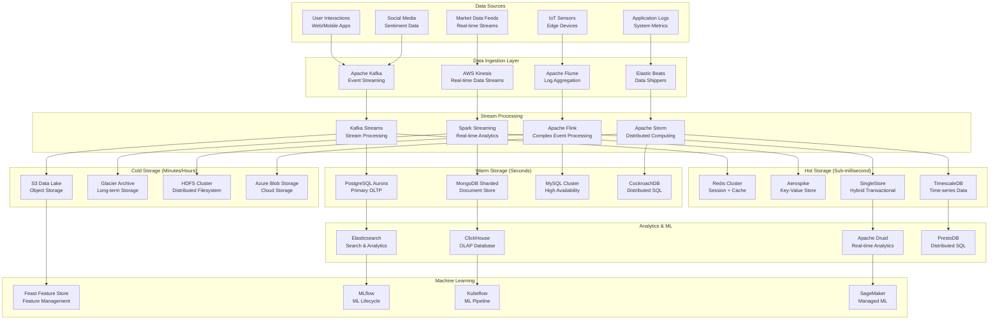

# Scalable Data Architecture Design

## 🗄️ High-Level Data Architecture



## 📊 Data Storage Strategy by Use Case

### Real-time Trading Data (Sub-millisecond latency)
```yaml
# high-frequency-trading-config.yaml
apiVersion: v1
kind: ConfigMap
metadata:
  name: hft-data-config
data:
  redis-config.conf: |
    # Redis Cluster Configuration for HFT Data
    cluster-enabled yes
    cluster-config-file nodes.conf
    cluster-node-timeout 5000
    cluster-require-full-coverage no
    
    # Performance tuning
    maxmemory 8gb
    maxmemory-policy allkeys-lru
    save ""
    appendonly no
    
    # Network optimization
    tcp-keepalive 60
    tcp-backlog 511
    timeout 0
    
    # High throughput settings
    hz 10
    dynamic-hz yes
    io-threads 4
    io-threads-do-reads yes
  
  aerospike-config.yaml: |
    service:
      paxos-single-replica-limit: 1
      pidfile: /var/run/aerospike/asd.pid
      service-threads: 32
      transaction-queues: 32
      transaction-threads-per-queue: 4
      proto-fd-max: 15000
      
    namespaces:
      - name: trading-data
        memory-size: 16G
        default-ttl: 0
        storage-engine: device
        files:
          - /opt/aerospike/data/trading.dat
        filesize: 128G
        data-in-memory: true
        write-block-size: 128K
        
      - name: market-depth
        memory-size: 8G
        default-ttl: 3600
        storage-engine: memory
        
      - name: user-sessions
        memory-size: 4G
        default-ttl: 1800
        storage-engine: memory
```

### Time-Series Market Data
```yaml
# timescaledb-config.yaml
apiVersion: v1
kind: ConfigMap
metadata:
  name: timescaledb-market-data-config
data:
  postgresql.conf: |
    # TimescaleDB Configuration for Market Data
    shared_preload_libraries = 'timescaledb,timescaledb_toolkit'
    max_connections = 1000
    max_worker_processes = 16
    max_parallel_workers = 16
    max_parallel_workers_per_gather = 4
    
    # Memory settings
    shared_buffers = 8GB
    effective_cache_size = 24GB
    work_mem = 256MB
    maintenance_work_mem = 2GB
    
    # WAL settings
    wal_buffers = 16MB
    wal_compression = on
    max_wal_size = 4GB
    min_wal_size = 1GB
    checkpoint_completion_target = 0.9
    
    # Performance settings
    random_page_cost = 1.1
    effective_io_concurrency = 200
    
  schema.sql: |
    -- Create TimescaleDB hypertables for market data
    CREATE EXTENSION IF NOT EXISTS timescaledb;
    CREATE EXTENSION IF NOT EXISTS timescaledb_toolkit;
    
    -- Stock price data table
    CREATE TABLE stock_prices (
        time TIMESTAMPTZ NOT NULL,
        symbol VARCHAR(10) NOT NULL,
        open DECIMAL(10,4),
        high DECIMAL(10,4),
        low DECIMAL(10,4),
        close DECIMAL(10,4),
        volume BIGINT,
        adjusted_close DECIMAL(10,4)
    );
    
    SELECT create_hypertable('stock_prices', 'time', chunk_time_interval => INTERVAL '1 day');
    CREATE INDEX idx_stock_prices_symbol_time ON stock_prices (symbol, time DESC);
    
    -- Market depth table
    CREATE TABLE market_depth (
        time TIMESTAMPTZ NOT NULL,
        symbol VARCHAR(10) NOT NULL,
        bid_price DECIMAL(10,4) NOT NULL,
        bid_size BIGINT NOT NULL,
        ask_price DECIMAL(10,4) NOT NULL,
        ask_size BIGINT NOT NULL,
        level INTEGER NOT NULL
    );
    
    SELECT create_hypertable('market_depth', 'time', chunk_time_interval => INTERVAL '1 hour');
    CREATE INDEX idx_market_depth_symbol_time ON market_depth (symbol, time DESC);
    
    -- User trading activity table
    CREATE TABLE user_trades (
        time TIMESTAMPTZ NOT NULL,
        user_id UUID NOT NULL,
        symbol VARCHAR(10) NOT NULL,
        action VARCHAR(10) NOT NULL,
        quantity INTEGER NOT NULL,
        price DECIMAL(10,4) NOT NULL,
        order_type VARCHAR(20) NOT NULL
    );
    
    SELECT create_hypertable('user_trades', 'time', chunk_time_interval => INTERVAL '1 week');
    CREATE INDEX idx_user_trades_user_time ON user_trades (user_id, time DESC);
    CREATE INDEX idx_user_trades_symbol_time ON user_trades (symbol, time DESC);
```

## 🔄 Data Partitioning & Sharding Strategy

### PostgreSQL Partitioning
```sql
-- Partitioned user activity table
CREATE TABLE user_activity (
    id BIGSERIAL,
    user_id UUID NOT NULL,
    activity_type VARCHAR(50) NOT NULL,
    activity_data JSONB,
    created_at TIMESTAMPTZ NOT NULL,
    PRIMARY KEY (id, created_at)
) PARTITION BY RANGE (created_at);

-- Create monthly partitions
CREATE TABLE user_activity_2024_01 PARTITION OF user_activity
    FOR VALUES FROM ('2024-01-01') TO ('2024-02-01');

CREATE TABLE user_activity_2024_02 PARTITION OF user_activity
    FOR VALUES FROM ('2024-02-01') TO ('2024-03-01');

-- Create indexes on partitions
CREATE INDEX idx_user_activity_2024_01_user_created ON user_activity_2024_01 (user_id, created_at DESC);
CREATE INDEX idx_user_activity_2024_02_user_created ON user_activity_2024_02 (user_id, created_at DESC);

-- Automated partition creation function
CREATE OR REPLACE FUNCTION create_monthly_partition() RETURNS void AS $$
DECLARE
    partition_name text;
    start_date date;
    end_date date;
BEGIN
    start_date := date_trunc('month', CURRENT_DATE + interval '1 month');
    end_date := start_date + interval '1 month';
    partition_name := 'user_activity_' || to_char(start_date, 'YYYY_MM');
    
    EXECUTE format('CREATE TABLE IF NOT EXISTS %I PARTITION OF user_activity FOR VALUES FROM (%L) TO (%L)',
                   partition_name, start_date, end_date);
    
    EXECUTE format('CREATE INDEX IF NOT EXISTS %I ON %I (user_id, created_at DESC)',
                   'idx_' || partition_name || '_user_created', partition_name);
END;
$$ LANGUAGE plpgsql;
```

### MongoDB Sharding
```javascript
// MongoDB sharding configuration
sh.enableSharding("trading_platform");

// Shard user data by user_id
sh.shardCollection("trading_platform.users", {
    "_id": "hashed"
});

// Shard chat messages by room_id and timestamp
sh.shardCollection("trading_platform.chat_messages", {
    "room_id": 1,
    "timestamp": 1
});

// Shard trading data by symbol and date
sh.shardCollection("trading_platform.trades", {
    "symbol": 1,
    "trade_date": 1
});

// Configure zone sharding for geographic distribution
sh.addShardToZone("shard0001", "US_East");
sh.addShardToZone("shard0002", "US_West");
sh.addShardToZone("shard0003", "EU_Central");

sh.updateZoneKeyRange("trading_platform.users", {
    "region": "US_East",
    "_id": MinKey
}, {
    "region": "US_East",
    "_id": MaxKey
}, "US_East");
```

## 📈 Data Pipeline Architecture

### Apache Kafka Configuration
```yaml
# kafka-cluster-config.yaml
apiVersion: kafka.strimzi.io/v1beta2
kind: Kafka
metadata:
  name: trading-platform-kafka
  namespace: kafka
spec:
  kafka:
    version: 3.6.0
    replicas: 5
    listeners:
      - name: plain
        port: 9092
        type: internal
        tls: false
      - name: tls
        port: 9093
        type: internal
        tls: true
        authentication:
          type: tls
      - name: external
        port: 9094
        type: loadbalancer
        tls: true
        authentication:
          type: scram-sha-512
    config:
      num.network.threads: 8
      num.io.threads: 16
      socket.send.buffer.bytes: 102400
      socket.receive.buffer.bytes: 102400
      socket.request.max.bytes: 104857600
      num.partitions: 24
      default.replication.factor: 3
      min.insync.replicas: 2
      compression.type: lz4
      log.retention.hours: 168
      log.segment.bytes: 1073741824
      log.retention.check.interval.ms: 300000
      num.replica.fetchers: 4
      replica.socket.timeout.ms: 30000
      replica.socket.receive.buffer.bytes: 65536
    storage:
      type: persistent-claim
      size: 2Ti
      class: fast-ssd
    resources:
      requests:
        memory: 8Gi
        cpu: 4000m
      limits:
        memory: 16Gi
        cpu: 8000m
  zookeeper:
    replicas: 3
    storage:
      type: persistent-claim
      size: 100Gi
      class: fast-ssd
    resources:
      requests:
        memory: 2Gi
        cpu: 1000m
      limits:
        memory: 4Gi
        cpu: 2000m
  entityOperator:
    topicOperator: {}
    userOperator: {}
```

### Kafka Topics Configuration
```yaml
# kafka-topics.yaml
apiVersion: kafka.strimzi.io/v1beta2
kind: KafkaTopic
metadata:
  name: user-events
  namespace: kafka
  labels:
    strimzi.io/cluster: trading-platform-kafka
spec:
  partitions: 12
  replicas: 3
  config:
    retention.ms: 604800000  # 7 days
    segment.bytes: 1073741824  # 1GB
    compression.type: lz4
    max.message.bytes: 10485760  # 10MB
    min.insync.replicas: 2
---
apiVersion: kafka.strimzi.io/v1beta2
kind: KafkaTopic
metadata:
  name: trading-events
  namespace: kafka
  labels:
    strimzi.io/cluster: trading-platform-kafka
spec:
  partitions: 20
  replicas: 3
  config:
    retention.ms: 259200000  # 3 days
    segment.bytes: 536870912  # 512MB
    compression.type: lz4
    max.message.bytes: 5242880  # 5MB
    min.insync.replicas: 2
---
apiVersion: kafka.strimzi.io/v1beta2
kind: KafkaTopic
metadata:
  name: market-data-events
  namespace: kafka
  labels:
    strimzi.io/cluster: trading-platform-kafka
spec:
  partitions: 30
  replicas: 3
  config:
    retention.ms: 86400000  # 1 day
    segment.bytes: 268435456  # 256MB
    compression.type: snappy
    max.message.bytes: 1048576  # 1MB
    min.insync.replicas: 2
---
apiVersion: kafka.strimzi.io/v1beta2
kind: KafkaTopic
metadata:
  name: ai-events
  namespace: kafka
  labels:
    strimzi.io/cluster: trading-platform-kafka
spec:
  partitions: 8
  replicas: 3
  config:
    retention.ms: 43200000  # 12 hours
    segment.bytes: 134217728  # 128MB
    compression.type: lz4
    max.message.bytes: 20971520  # 20MB
    min.insync.replicas: 2
```

## 🔄 Data Processing Pipeline

### Stream Processing with Kafka Streams
```java
// MarketDataProcessor.java
@Component
public class MarketDataProcessor {
    
    private static final Logger logger = LoggerFactory.getLogger(MarketDataProcessor.class);
    
    @Autowired
    private StreamsBuilder streamsBuilder;
    
    @PostConstruct
    public void processMarketData() {
        KStream<String, MarketDataEvent> marketDataStream = 
            streamsBuilder.stream("market-data-events",
                Consumed.with(Serdes.String(), new MarketDataEventSerde()));
        
        // Process real-time market data
        marketDataStream
            .filter((key, value) -> value.getSymbol() != null && value.getPrice() > 0)
            .mapValues(this::enrichMarketData)
            .groupByKey()
            .windowedBy(TimeWindows.ofSizeWithNoGrace(Duration.ofSeconds(1)))
            .aggregate(
                PriceAggregate::new,
                (key, value, aggregate) -> aggregate.update(value),
                Materialized.with(Serdes.String(), new PriceAggregateSerde())
            )
            .toStream()
            .map((windowedKey, aggregate) -> 
                KeyValue.pair(windowedKey.key(), aggregate))
            .to("processed-market-data", 
                Produced.with(Serdes.String(), new PriceAggregateSerde()));
        
        // Calculate technical indicators
        marketDataStream
            .groupByKey()
            .windowedBy(TimeWindows.ofSizeWithNoGrace(Duration.ofMinutes(5)))
            .aggregate(
                TechnicalIndicators::new,
                (key, value, indicators) -> indicators.calculate(value),
                Materialized.with(Serdes.String(), new TechnicalIndicatorsSerde())
            )
            .toStream()
            .map((windowedKey, indicators) -> 
                KeyValue.pair(windowedKey.key(), indicators))
            .to("technical-indicators",
                Produced.with(Serdes.String(), new TechnicalIndicatorsSerde()));
    }
    
    private MarketDataEvent enrichMarketData(MarketDataEvent event) {
        // Add calculated fields
        event.setTimestamp(Instant.now());
        event.setVolumeWeightedPrice(calculateVWAP(event));
        event.setBidAskSpread(event.getAskPrice() - event.getBidPrice());
        return event;
    }
    
    private double calculateVWAP(MarketDataEvent event) {
        return (event.getBidPrice() * event.getBidSize() + 
                event.getAskPrice() * event.getAskSize()) / 
               (event.getBidSize() + event.getAskSize());
    }
}
```

### Batch Processing with Spark
```scala
// TradingDataAnalytics.scala
import org.apache.spark.sql.SparkSession
import org.apache.spark.sql.functions._
import org.apache.spark.sql.types._

object TradingDataAnalytics {
  def main(args: Array[String]): Unit = {
    val spark = SparkSession.builder()
      .appName("TradingDataAnalytics")
      .config("spark.sql.adaptive.enabled", "true")
      .config("spark.sql.adaptive.coalescePartitions.enabled", "true")
      .config("spark.sql.shuffle.partitions", "200")
      .getOrCreate()
    
    // Define schema for trading data
    val tradingSchema = StructType(Array(
      StructField("timestamp", TimestampType, nullable = false),
      StructField("user_id", StringType, nullable = false),
      StructField("symbol", StringType, nullable = false),
      StructField("action", StringType, nullable = false),
      StructField("quantity", IntegerType, nullable = false),
      StructField("price", DecimalType(10, 4), nullable = false),
      StructField("order_type", StringType, nullable = false)
    ))
    
    // Read trading data from S3
    val tradingData = spark.read
      .schema(tradingSchema)
      .parquet("s3://trading-platform-data/trades/")
    
    // Calculate user trading statistics
    val userStats = tradingData
      .groupBy("user_id", "symbol")
      .agg(
        count("*").alias("trade_count"),
        sum("quantity").alias("total_volume"),
        avg("price").alias("avg_price"),
        min("price").alias("min_price"),
        max("price").alias("max_price"),
        stddev("price").alias("price_volatility")
      )
      .withColumn("trading_range", col("max_price") - col("min_price"))
      .withColumn("last_updated", current_timestamp())
    
    // Calculate market analytics
    val marketAnalytics = tradingData
      .groupBy(window(col("timestamp"), "1 hour"), "symbol")
      .agg(
        count("*").alias("hourly_trades"),
        sum("quantity").alias("hourly_volume"),
        avg("price").alias("avg_price"),
        first("price").alias("open_price"),
        last("price").alias("close_price"),
        min("price").alias("low_price"),
        max("price").alias("high_price")
      )
      .withColumn("price_change", col("close_price") - col("open_price"))
      .withColumn("price_change_pct", 
        (col("close_price") - col("open_price")) / col("open_price") * 100)
    
    // Detect unusual trading patterns
    val unusualPatterns = tradingData
      .groupBy("user_id")
      .agg(
        count("*").alias("total_trades"),
        avg("quantity").alias("avg_quantity"),
        stddev("quantity").alias("quantity_stddev"),
        avg("price").alias("avg_price"),
        stddev("price").alias("price_stddev")
      )
      .join(tradingData, "user_id")
      .where(
        abs(col("quantity") - col("avg_quantity")) > 3 * col("quantity_stddev") ||
        abs(col("price") - col("avg_price")) > 3 * col("price_stddev")
      )
      .select(
        col("user_id"),
        col("timestamp"),
        col("symbol"),
        col("quantity"),
        col("price"),
        col("avg_quantity"),
        col("avg_price"),
        lit("unusual_pattern").alias("alert_type")
      )
    
    // Write results to different storage systems
    userStats.write
      .mode("overwrite")
      .jdbc("jdbc:postgresql://analytics-db:5432/trading", 
            "user_trading_stats", getPostgresProperties())
    
    marketAnalytics.write
      .mode("overwrite")
      .format("org.apache.spark.sql.cassandra")
      .options(Map(
        "table" -> "market_analytics",
        "keyspace" -> "trading_platform"
      ))
      .save()
    
    unusualPatterns.write
      .mode("append")
      .parquet("s3://trading-platform-data/alerts/unusual_patterns/")
    
    spark.stop()
  }
  
  def getPostgresProperties(): java.util.Properties = {
    val properties = new java.util.Properties()
    properties.put("user", "analytics_user")
    properties.put("password", "analytics_password")
    properties.put("driver", "org.postgresql.Driver")
    properties
  }
}
```

## 🎯 Key Data Architecture Benefits

### 1. **Scalability**
- Horizontal scaling with partitioning and sharding
- Auto-scaling based on data volume
- Distributed processing with Spark and Flink
- Multi-region data replication

### 2. **Performance**
- Sub-millisecond latency with Redis and Aerospike
- Optimized data structures for specific use cases
- Intelligent caching strategies
- Parallel processing capabilities

### 3. **Reliability**
- Multi-level data redundancy
- Automatic failover mechanisms
- Data consistency guarantees
- Disaster recovery procedures

### 4. **Cost Optimization**
- Intelligent data tiering (hot/warm/cold)
- Compressed storage for historical data
- Spot instances for batch processing
- Lifecycle management policies

### 5. **Flexibility**
- Multi-model database support
- Schema evolution capabilities
- Polyglot persistence strategy
- Cloud-agnostic architecture

This scalable data architecture provides a robust foundation for handling massive volumes of trading data, user interactions, and AI processing requirements while maintaining high performance and cost-effectiveness.